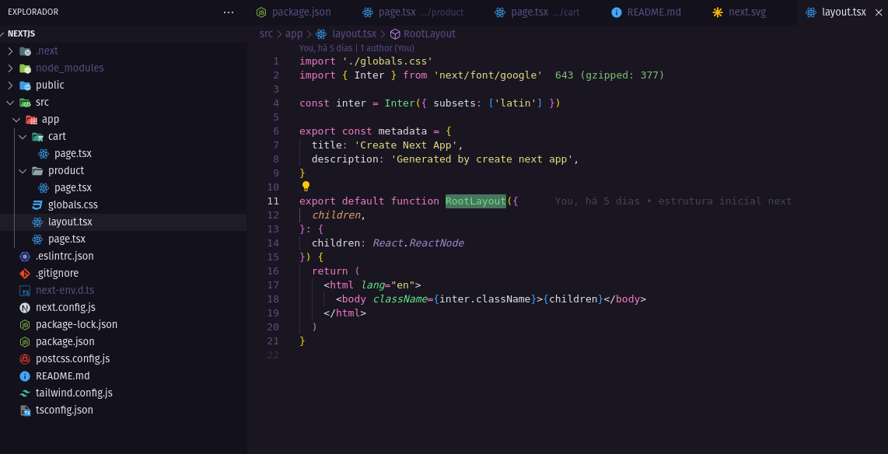

# NextJS 13

O [NextJS](https://nextjs.org/) surgiu com o objetivo de sanar as dores
geradas/encontradas pelas Single Page Applications (SPA).

## Iniciando um Projeto

É recomendado que para iniciar um novo projeto, seja utilizando o comando
`npx create-next-app@latest`, que irá configurar tudo automaticamente para você.

```
npx create-next-app@latest
```

Por padrão, na configuração do NextJS, é oferecido a opção de utilizar
TypeScript, ESLint e Tailwind CSS.

## Arquivos Padrões

### layout.tsx



- Define a estrutura que vai ser repetida em todas as páginas da aplicação.
- É o único arquivo que tem a função 'RootLayout'.
- Mesmo durante a troca de rotas, as informações contidas no layout.tsx não são
  recarregadas (isso inclui requisições HTTP), o NextJS entende que essas
  informações devem ser persistentes.

## Rotas
